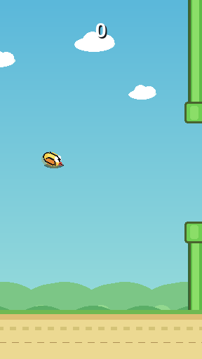

# Tiny Flap

A tiny Pygame arcade game inspired by the familiar flap-through-the-pipes
formula. It is intentionally small, casual, and easy to run, while still having
a little polish: animated fallback art, parallax scenery, scoring feedback,
generated sound effects, and persistent best-score tracking.

The game will use `bird.png`, `pipe.png`, and `background.png` if they are placed
next to `flappy.py`; otherwise it draws built-in fallback art so the project can
run as-is.

## Screenshot



## Run

```bash
python3 -m pip install -r requirements.txt
python3 flappy.py
```

You can also install it locally as a tiny command-line app:

```bash
python3 -m pip install -e .
tiny-flap
```

## Controls

| Action | Input |
| --- | --- |
| Start / flap / retry | Space or mouse click |
| Pause / resume | P |
| Quit | Esc |

## Project Structure

```text
.
├── flappy.py              # Main game code
├── requirements.txt       # Minimal runtime dependency
├── pyproject.toml         # Optional package metadata
├── .gitignore             # Local files and Python artifacts to ignore
├── LICENSE                # MIT license
├── screenshots/           # README images
└── .github/workflows/ci.yml
```

Optional image assets can live next to `flappy.py`:

```text
bird.png
pipe.png
background.png
```

## Features

- Generated fallback graphics so missing assets do not crash startup.
- Animated fallback bird art with idle bobbing.
- Richer pipe shading, parallax clouds and hills, and ground details.
- Home, pause, and game-over states.
- Score pop feedback, crash shake, and crash flash.
- Persistent best score saved outside the repo in `~/.tiny_flap/high_score.txt`.
- Progressive pipe speed as the score increases.
- Generated sound effects when audio is available.

## Known Limitations

- This is a casual clone-style project, not a production game engine.
- The game is tuned by feel rather than by formal playtesting.
- Custom image assets are supported, but there is no dedicated `assets/` loader yet.
